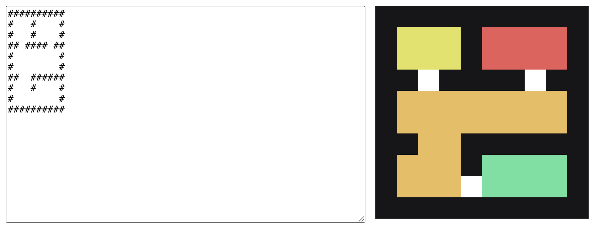

# Colored Rooms

### Explanation

A floor plan is an abstract representation of a building floor and defined by the distribution of walls and space.  For this project, floor plans are represented by ASCII characters, with walls being “#” and empty spaces being “ “ (white space). A room is defined by a cluster of adjacent spaces surrounded by walls and doors. A door is defined by a single space that divides two collinear walls.

Here is a simple example of a floor with 3 rooms:

```
##########
#   #    #
#   #    #
## #### ##
#        #
#        #
##########
```

We want to make the rooms easily distinguishable from each other by using colors.

Write a simple piece of software that receives an ASCII floor plan and prints a nice, beautiful and colorful rendering of the floor plan with the rooms colorized.

For this project, consider:
All spaces are reachable.
You can assume there are no rooms 1 space wide (for example, narrow hallways).
Use any programming language you like.
Use your creativity for color choice and rendering style.
Spend no more than 1 hour.

As an example, this input:

```
##########
#   #    #
#   #    #
## #### ##
#        #
#        #
#  #######
#  #  #  #
#        #
##########
```

should output something like:

```
##########
#   #    #
#   #    #
## #### ##
#        #
#        #
#  #######
#  #  #  #
#        #
##########
```

Have fun!

### Solution

Demo Link: https://colored-rooms.vercel.app/

